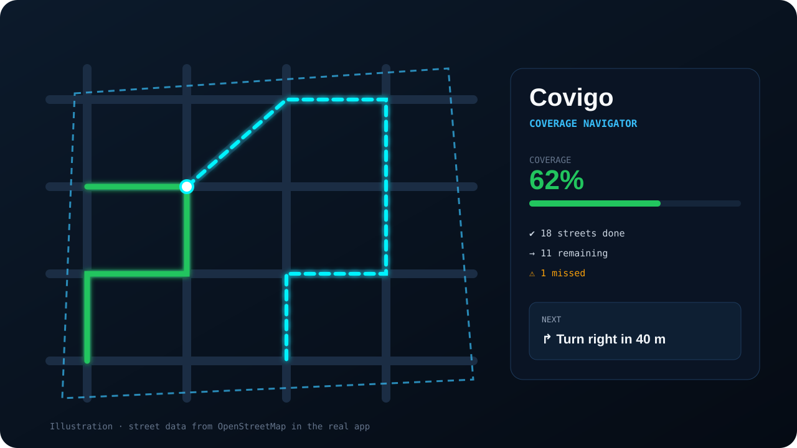

<!-- ================= HEADER ================= -->

 

<!-- ================= STATUS PILLS ================= -->

  
  &nbsp;
  
  &nbsp;
  
  &nbsp;
  
  &nbsp;
  

<!-- ================= TYPEWRITER ================= -->

---

<!-- ================= COMMAND CENTER BANNER ================= -->

  

<!-- ================= ID BADGE & TELEMETRY ================= -->
<table border="0" width="100%" cellpadding="0" cellspacing="0">
  <tr>
    <td width="42%" align="center" valign="top">
      
    </td>
    <td width="58%" align="center" valign="top">
      
    </td>
  </tr>
</table>

<!-- ================= PIPELINE ================= -->

  

<!-- ================= CONTRIBUTION SNAKE ================= -->

  <picture>
    <source media="(prefers-color-scheme: dark)" srcset="https://raw.githubusercontent.com/alokekissac/alokekissac/output/github-contribution-grid-snake-dark.svg">
    <source media="(prefers-color-scheme: light)" srcset="https://raw.githubusercontent.com/alokekissac/alokekissac/output/github-contribution-grid-snake.svg">
    
  </picture>

---

## ⚡ How I Work

> *"A model isn't done when the loss goes down. It's done when it beats a sensible baseline on data it has never seen, and someone can actually use it."*

<table width="100%">
  <tr>
    <td width="33%" valign="top">
      <h4>📏 Baselines first, honest metrics</h4>
      Every model is compared against simple baselines and, where possible, the exact optimum. Results come from held-out data and multiple seeds, and I report them even when the simple model wins.
    </td>
    <td width="33%" valign="top">
      <h4>🚀 From notebook to product</h4>
      Research ends up as something usable: a Flask API with input validation, a web app or dashboard, and a one-click Vercel deploy.
    </td>
    <td width="33%" valign="top">
      <h4>🧩 Reproducible by default</h4>
      Seeded training scripts, saved models, tests, executed notebooks and READMEs that explain the method, the results and the limitations.
    </td>
  </tr>
</table>

---

<!-- ================= PROJECTS ================= -->

## 🚀 Featured Projects

Machine learning research, reinforcement learning and full-stack AI apps, each with a detailed README.
  

<table border="0" width="100%">
  <tr>
    <td align="center" colspan="2" valign="top">
      
        
      <b>♻️ AI-Powered Landfill Waste Forecasting</b>&nbsp;&nbsp;<code>MSc AI · Applied Research Project</code> 
      Forecasts US state-level landfill waste from 127K EPA records. I compared five models (Linear Regression, Random Forest, Gradient Boosting, XGBoost and a PyTorch LSTM). The simplest, Linear Regression, won with <b>R² 0.986</b>, and it's deployed as an interactive Flask + Chart.js dashboard.
        
      <code>Python</code> • <code>scikit-learn</code> • <code>XGBoost</code> • <code>PyTorch</code> • <code>pandas</code> • <code>Flask</code> • <code>Chart.js</code>
        
      
      &nbsp;
      
    </td>
  </tr>
  <tr>
    <td align="center" colspan="2" valign="top">
      
        
      <b>🔎 Advanced RAG System</b> 
      Trustworthy Q&amp;A over private documents. It combines hybrid retrieval (BM25 + embeddings, RRF + MMR) with cited answers, citation verification, abstention and prompt-injection guardrails, plus an evaluation harness. <b>95.7% answer accuracy</b> and <b>100% correct abstentions</b> on the held-out test split. Runs with a Gemini LLM or fully offline.
        
      <code>Python</code> • <code>FastAPI</code> • <code>RAG</code> • <code>Embeddings</code> • <code>Vector search</code> • <code>Gemini</code> • <code>pytest</code>
        
      
    </td>
  </tr>
  <tr>
    <td align="center" width="50%" valign="top">
      
        
      <b>🚦 RL Traffic Signal Control</b> 
      Q-learning and Monte Carlo agents learn when to switch a traffic light. They're checked against the exact optimal policy from value iteration: Q-learning comes within 0.009 cars of it and has <b>37% fewer cars waiting</b> than fixed-time signals. Includes a 3D Three.js simulator.
        
      <code>Gymnasium</code> • <code>NumPy</code> • <code>Flask</code> • <code>Three.js</code> • <code>pytest</code>
        
      
      &nbsp;
      
    </td>
    <td align="center" width="50%" valign="top">
      
        
      <b>🧭 Covigo: Coverage Navigator</b> 
      Draw a zone and walk every street in it. Covigo pulls streets from OpenStreetMap, plans the route, guides you turn by turn with GPS and flags missed streets. It also has a Gemini assistant with voice input, and works offline as a PWA.
        
      <code>JavaScript</code> • <code>Leaflet</code> • <code>Overpass API</code> • <code>Gemini</code> • <code>PWA</code>
        
      
    </td>
  </tr>
  <tr>
    <td align="center" width="50%" valign="top">
      
        
      <b>🗺️ AI Tour Planner</b> 
      A tourism platform connecting travellers, tour providers and local guides. It has four role-based dashboards, an Android app, an AI travel chatbot, translation and photo-to-text OCR. I built it during my full-stack internship at Rizz Technologies.
        
      <code>Flask</code> • <code>MySQL</code> • <code>OpenAI</code> • <code>OpenCV</code> • <code>Android (Java)</code>
        
      
    </td>
    <td align="center" width="50%" valign="top">
      
        
      <b>✈️ Smart Travelogue</b> 
      A travel-journal platform where travellers write travelogues, share photos, videos and YouTube links, and find places, hotels and packages. It pairs a native Android app with a Flask REST API (27 endpoints) and an admin dashboard.
        
      <code>Flask</code> • <code>MySQL</code> • <code>REST API</code> • <code>Android (Java)</code> • <code>Bootstrap</code>
        
      
    </td>
  </tr>
</table>

---

<!-- ================= TECH STACK ================= -->

## 🛠️ Tech Stack

<table width="100%">
  <tr>
    <td align="center" width="50%" valign="top">
      <h4>🧠 AI &amp; Machine Learning</h4>
      
        
      scikit-learn • XGBoost • PyTorch (LSTM) • pandas • NumPy • Gymnasium (RL) • OpenCV • NLTK • Gemini / OpenAI APIs
    </td>
    <td align="center" width="50%" valign="top">
      <h4>⚙️ Backend &amp; APIs</h4>
      
        
      Flask • REST APIs • Jinja2 • input validation • serverless functions • pytest
    </td>
  </tr>
  <tr>
    <td align="center" width="50%" valign="top">
      <h4>🎨 Frontend &amp; Mobile</h4>
      
        
      JavaScript • Three.js • Chart.js • Leaflet • Bootstrap • PWAs • Android (Java)
    </td>
    <td align="center" width="50%" valign="top">
      <h4>💾 Data, DevOps &amp; Tools</h4>
      
        
      MySQL • SQLite • Git &amp; GitHub • GitHub Actions • Vercel • Jupyter
    </td>
  </tr>
</table>

---

<!-- ================= GITHUB STATS ================= -->

## 📈 GitHub Activity

  
  &nbsp;
  

---

<!-- ================= CONTACT ================= -->

## 📡 Let's Connect

 

  
  &nbsp;
  
  &nbsp;
  
  &nbsp;
  
  &nbsp;
  

 

<table border="0" cellpadding="0" cellspacing="0">
  <tr>
    <td align="center" valign="middle" width="180">
      <b>Scan for my portfolio</b>  
      
    </td>
    <td align="center" valign="middle">
      
    </td>
  </tr>
</table>

  

